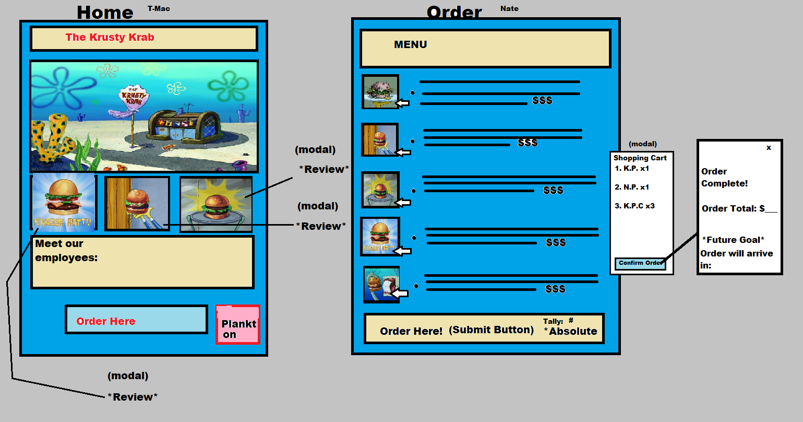
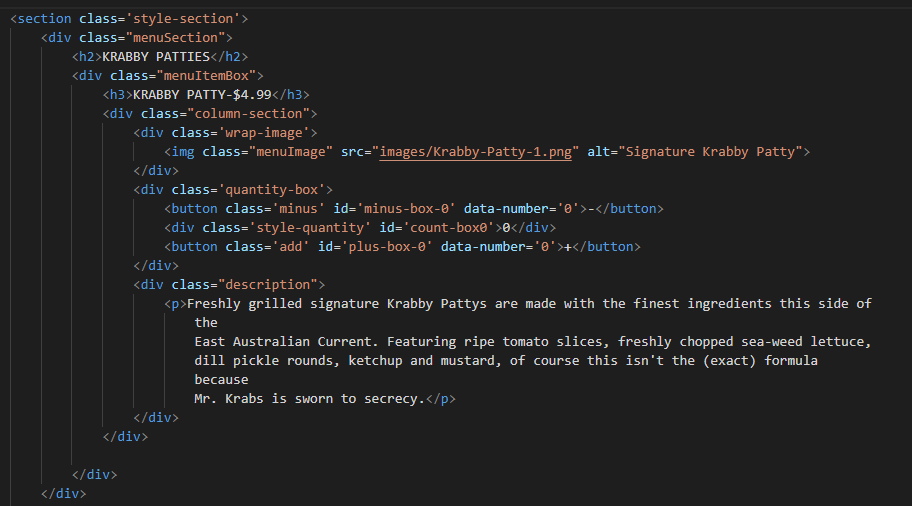
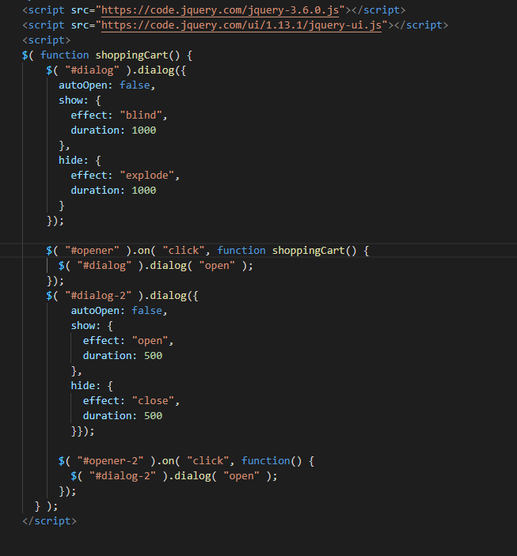

# Project-1-KrustyKrabs

PROJECT GROUP MEMBERS
-
Nathan Milburn, Chris Mugisha, Lamor Odingo, Taylor Thompson, Daniel Juarez

PROJECT SUB-GROUPS
-
GROUP ONE (Homepage/YouTube API):
Taylor Thompson, Chris Mugisha

GROUP TWO (Menu Page/Modal APIs): 
Nathan Milburn, Lamor Odingo

FLOATER ROLE (All-Around Assisting/Google Maps API):
Daniel Juarez

USER STORY
-

AS A group of aspiring software and web developers

WE WANTED to create a responsive webpage that featured a variety of modals and APIs through the lense of a character from SpongeBob SquarePants

SO THAT we could showcase our collective development skills and give users a nostalgic and fun website for them to browse.

BEGINNING STEPS
-

1. Meet as a group to brainstorm ideas for our group project.

2. Once an idea was selected, the next step was to create a basic wireframe of what we invisioned our webpage to look like.

3. Break out our larger group into sub groups with specific pages/tasks for each group to reduce the risk of overlap with merge conflicts.

4. Research APIs that we would like to include on our webpage and determine where we would like them to be presented/how we would like them to be implemented.

5. Final meeting with the group before coding to ensure we are all on the same page with the same creative vision/implementation in mind.

6. BEGIN CODING!

FIRST PROJECT IDEA
-
 
Create a responsive website for a finctional restaurant that would allow for users to view "customer" reviews, see how far they are from the store's location, and select items from a menu that would be displayed in a shopping cart modal.

PROJECT WIREFRAME
-

PROCESS EXPLANATION
-

Taylor's Tasks/Processes:
- My task was content creation for the HTML and CSS. Also making sure the CSS was cohesive across our different pages.

Chris's Tasks/Processes:
- My task was to implement a YouTube API that would exist on our home page and allow users to watch a video without having to go to another page. The video also acts as a pseudo commercial for the fictional website.

Lamor's Tasks/Processes:
- My task was creating the buttons and the integer box to have a user choose to increase or decrease the quantity of items they want to request for each item name. And to print those results in the modal shopping cart so the user could see what they ordered and how many before checkout.

Nathan's Tasks/Processes:
- My tasks for this project was to set up the html for the menu page, implement a working shopping cart/confirm order nested modal for said page, and work with Lamor to tag team the javascript for the menu items/shopping cart. Setting up the html for the menu page was pretty straight forward at the beginning, but additional adjustments were required to make Lamor's JS code work in conjunction with specific element tags. Once we had a basic skeleton html in place, my next step was to find image stills from the SpongeBob SquarePants cartoon series that could make up menu items for our restaurant page. After creating div tags for each item on the menu, which was broken up into three sections (Burgers, International, and Beverages) I placed the corresponding image to the menu item and wrote a full description for each one. Although, I opted to use inside references for some of the menu items. My next step was to create a modal that would act as the page's shopping cart and would display each item chosen with a count of how many were selected. My first thought was to have two separate modals for a shopping cart, and a confirm order button. But after testing out some modal examples from the jqueryui website, I thought that nesting a second modal into the shopping cart would be the better (and more streamlined option). Once those modals were created the final modal step was to link Lamor's incrementing JS code to display on the shopping cart. Finally, my last task was to do an overall proofread of all of our pages and draft up our README.md file.

Menu Item HTML Example:

Shopping Cart Modal:

Daniel's Tasks/Processes:
- My task was the integration of google maps API and to create a button which opened a modal that displayed the location of our restaurant, the Krusty Krab.

FUTURE DEVELOPMENT IDEAS
-

- Add a moment(). function that accounts for the current time and sets an expected delivery time of 30 minutes past the current time.

- Looping background music of the end credits song to add an additional level of atmosphere and nostalgia.

- Build an incrementing function that shows the sum of all items selected in the shopping card modal.

- Add a modal on the home page that reads "Secret Formula Here," which would then display a warning alert saying "We know it's you, Plankton."

DEPLOYED APPLICATION AND REPOSITORY
-

[DeployedRestaurantWebsite](https://taylor25et.github.io/Project-1-KrustyKrabs/)
[DeployedProjectRepository](https://github.com/Taylor25et/Project-1-KrustyKrabs.git)